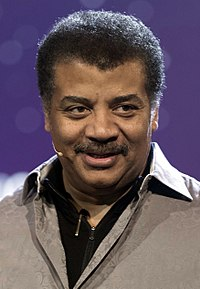

<table class="infobox biography vcard">
<tbody>
<tr>
<th colspan="2">

Neil deGrasse Tyson

</th>
</tr>
<tr>
<td colspan="2">

Tyson in 2017, receiving the Stephen Hawking Science Medal

</td>
</tr>
<tr>
<th scope="row">Born</th>
<td>October 5, 1958&nbsp;(age&nbsp;61) 

<a title="Manhattan" href="https://en.wikipedia.org/wiki/Manhattan">Manhattan</a>, New York City, U.S.

</td>
</tr>
<tr>
<th scope="row">Spouse(s)</th>
<td>

Alice Young (<abbr title="married">m.</abbr>&nbsp;1988)

</td>
</tr>
<tr>
<th scope="row">Children</th>
<td>2</td>
</tr>
<tr>
<td colspan="2">&nbsp;</td>
</tr>
<tr>
<th scope="row">Education</th>
<td><a title="Harvard University" href="https://en.wikipedia.org/wiki/Harvard_University">Harvard University</a>&nbsp;(<a title="Bachelor of Arts" href="https://en.wikipedia.org/wiki/Bachelor_of_Arts">AB</a>) <a title="University of Texas at Austin" href="https://en.wikipedia.org/wiki/University_of_Texas_at_Austin">University of Texas at Austin</a>&nbsp;(<a title="Master of Arts" href="https://en.wikipedia.org/wiki/Master_of_Arts">MA</a>) <a title="Columbia University" href="https://en.wikipedia.org/wiki/Columbia_University">Columbia University</a>&nbsp;(<a title="Master of Philosophy" href="https://en.wikipedia.org/wiki/Master_of_Philosophy">MPhil</a>,&nbsp;<a title="Doctor of Philosophy" href="https://en.wikipedia.org/wiki/Doctor_of_Philosophy">PhD</a>)</td>
</tr>
<tr>
<th scope="row">Awards</th>
<td><a title="NASA Distinguished Public Service Medal" href="https://en.wikipedia.org/wiki/NASA_Distinguished_Public_Service_Medal">NASA Distinguished Public Service Medal</a>&nbsp;(2004) <a title="Klopsteg Memorial Award" href="https://en.wikipedia.org/wiki/Klopsteg_Memorial_Award">Klopsteg Memorial Award</a>&nbsp;(2007) <a title="Public Welfare Medal" href="https://en.wikipedia.org/wiki/Public_Welfare_Medal">Public Welfare Medal</a>&nbsp;(2015)</td>
</tr>
<tr>
<td colspan="2"><strong>Scientific career</strong></td>
</tr>
<tr>
<th scope="row">Fields</th>
<td class="category">

<ul>
<li><a title="Astrophysics" href="https://en.wikipedia.org/wiki/Astrophysics">Astrophysics</a></li>
<li><a class="mw-redirect" title="Science Communication" href="https://en.wikipedia.org/wiki/Science_Communication">Science Communication</a></li>
</ul>

</td>
</tr>
<tr>
<th scope="row">Institutions</th>
<td><a title="University of Maryland, College Park" href="https://en.wikipedia.org/wiki/University_of_Maryland,_College_Park">University of Maryland, College Park</a> <a title="Princeton University" href="https://en.wikipedia.org/wiki/Princeton_University">Princeton University</a> <a title="American Museum of Natural History" href="https://en.wikipedia.org/wiki/American_Museum_of_Natural_History">American Museum of Natural History</a></td>
</tr>
<tr>
<th scope="row"><a title="Thesis" href="https://en.wikipedia.org/wiki/Thesis">Thesis</a></th>
<td><a class="external text" href="http://adsabs.harvard.edu/abs/1992PhDT.........1T" rel="nofollow"><em>A study of the abundance distributions along the minor axis of the Galactic bulge</em></a>&nbsp;(1991)</td>
</tr>
<tr>
<th scope="row"><a title="Doctoral advisor" href="https://en.wikipedia.org/wiki/Doctoral_advisor">Doctoral advisor</a></th>
<td><a title="R. Michael Rich" href="https://en.wikipedia.org/wiki/R._Michael_Rich">R. Michael Rich</a></td>
</tr>
<tr>
<th scope="row">Influences</th>
<td>

<ul>
<li><a title="Carl Sagan" href="https://en.wikipedia.org/wiki/Carl_Sagan">Carl Sagan</a></li>
</ul>

</td>
</tr>
<tr>
<th colspan="2">Signature</th>
</tr>
<tr>
<td colspan="2"></td>
</tr>
</tbody>
</table>

 

<strong>Neil deGrasse Tyson</strong>&nbsp;(American English:&nbsp;<a title="Help:IPA/English" href="https://en.wikipedia.org/wiki/Help:IPA/English">/dəˈɡr&aelig;s/</a>, British English, Australian English, New Zealand English, Indian English:&nbsp;<a title="Help:IPA/English" href="https://en.wikipedia.org/wiki/Help:IPA/English">/dəˈɡrɑːs/</a>&nbsp;; born October 5, 1958) is an American&nbsp;<a title="Astrophysics" href="https://en.wikipedia.org/wiki/Astrophysics">astrophysicist</a>,&nbsp;<a title="Cosmology" href="https://en.wikipedia.org/wiki/Cosmology">cosmologist</a>,&nbsp;<a title="Planetary science" href="https://en.wikipedia.org/wiki/Planetary_science">planetary scientist</a>,&nbsp;<a title="Author" href="https://en.wikipedia.org/wiki/Author">author</a>, and&nbsp;<a title="Science communication" href="https://en.wikipedia.org/wiki/Science_communication">science communicator</a>.

Since 1996, he has been the&nbsp;<a title="Frederick P. Rose" href="https://en.wikipedia.org/wiki/Frederick_P._Rose">Frederick P. Rose</a>&nbsp;Director of the&nbsp;<a class="mw-redirect" title="Hayden Planetarium" href="https://en.wikipedia.org/wiki/Hayden_Planetarium">Hayden Planetarium</a>&nbsp;at the&nbsp;<a title="Rose Center for Earth and Space" href="https://en.wikipedia.org/wiki/Rose_Center_for_Earth_and_Space">Rose Center for Earth and Space</a>&nbsp;in&nbsp;<a title="New York City" href="https://en.wikipedia.org/wiki/New_York_City">New York City</a>. The center is part of the&nbsp;<a title="American Museum of Natural History" href="https://en.wikipedia.org/wiki/American_Museum_of_Natural_History">American Museum of Natural History</a>, where Tyson founded the Department of Astrophysics in 1997 and has been a research associate in the department since 2003.

Tyson studied at&nbsp;<a title="Harvard University" href="https://en.wikipedia.org/wiki/Harvard_University">Harvard University</a>, the&nbsp;<a title="University of Texas at Austin" href="https://en.wikipedia.org/wiki/University_of_Texas_at_Austin">University of Texas at Austin</a>, and&nbsp;<a title="Columbia University" href="https://en.wikipedia.org/wiki/Columbia_University">Columbia University</a>. From 1991 to 1994, he was a postdoctoral research associate at&nbsp;<a title="Princeton University" href="https://en.wikipedia.org/wiki/Princeton_University">Princeton University</a>. In 1994, he joined the Hayden Planetarium as a staff scientist and the Princeton faculty as a visiting research scientist and lecturer. In 1996, he became director of the&nbsp;<a title="Planetarium" href="https://en.wikipedia.org/wiki/Planetarium">planetarium</a>&nbsp;and oversaw its $210 million reconstruction project, which was completed in 2000.

From 1995 to 2005, Tyson wrote monthly essays in the "Universe" column for&nbsp;<em><a title="Natural History (magazine)" href="https://en.wikipedia.org/wiki/Natural_History_(magazine)">Natural History</a></em>&nbsp;magazine, some of which were later published in his books&nbsp;<em><a title="Death by Black Hole" href="https://en.wikipedia.org/wiki/Death_by_Black_Hole">Death by Black Hole</a></em>&nbsp;(2007) and&nbsp;<em><a title="Astrophysics for People in a Hurry" href="https://en.wikipedia.org/wiki/Astrophysics_for_People_in_a_Hurry">Astrophysics for People in a Hurry</a></em>&nbsp;(2017). During the same period, he wrote a monthly column in&nbsp;<em><a title="StarDate" href="https://en.wikipedia.org/wiki/StarDate">StarDate</a></em>&nbsp;magazine, answering questions about the universe under the pen name "Merlin". Material from the column appeared in his books&nbsp;<em>Merlin's Tour of the Universe</em>&nbsp;(1998) and&nbsp;<em>Just Visiting This Planet</em>&nbsp;(1998). Tyson served on a&nbsp;<a title="Commission on the Future of the United States Aerospace Industry" href="https://en.wikipedia.org/wiki/Commission_on_the_Future_of_the_United_States_Aerospace_Industry">2001 government commission</a>&nbsp;on the future of the U.S. aerospace industry and on the 2004&nbsp;<a title="President's Commission on Implementation of United States Space Exploration Policy" href="https://en.wikipedia.org/wiki/President%27s_Commission_on_Implementation_of_United_States_Space_Exploration_Policy">Moon, Mars and Beyond</a>&nbsp;commission. He was awarded the&nbsp;<a title="NASA Distinguished Public Service Medal" href="https://en.wikipedia.org/wiki/NASA_Distinguished_Public_Service_Medal">NASA Distinguished Public Service Medal</a>&nbsp;in the same year. From 2006 to 2011, he hosted the television show&nbsp;<em><a class="mw-redirect" title="NOVA ScienceNow" href="https://en.wikipedia.org/wiki/NOVA_ScienceNow">NOVA ScienceNow</a></em>&nbsp;on&nbsp;<a title="PBS" href="https://en.wikipedia.org/wiki/PBS">PBS</a>. Since 2009, Tyson has hosted the weekly podcast&nbsp;<em><a title="StarTalk (podcast)" href="https://en.wikipedia.org/wiki/StarTalk_(podcast)">StarTalk</a></em>. A spin-off, also called&nbsp;<em><a class="mw-redirect" title="StarTalk (U.S. talk show)" href="https://en.wikipedia.org/wiki/StarTalk_(U.S._talk_show)">StarTalk</a></em>, began airing on&nbsp;<a class="mw-redirect" title="National Geographic (U.S. TV channel)" href="https://en.wikipedia.org/wiki/National_Geographic_(U.S._TV_channel)">National Geographic</a>&nbsp;in 2015. In 2014, he hosted the television series&nbsp;<em><a title="Cosmos: A Spacetime Odyssey" href="https://en.wikipedia.org/wiki/Cosmos:_A_Spacetime_Odyssey">Cosmos: A Spacetime Odyssey</a></em>, a successor to&nbsp;<a title="Carl Sagan" href="https://en.wikipedia.org/wiki/Carl_Sagan">Carl Sagan</a>'s 1980 series&nbsp;<em><a title="Cosmos: A Personal Voyage" href="https://en.wikipedia.org/wiki/Cosmos:_A_Personal_Voyage">Cosmos: A Personal Voyage</a></em>.&nbsp;The U.S.&nbsp;<a title="National Academy of Sciences" href="https://en.wikipedia.org/wiki/National_Academy_of_Sciences">National Academy of Sciences</a>&nbsp;awarded Tyson the&nbsp;<a title="Public Welfare Medal" href="https://en.wikipedia.org/wiki/Public_Welfare_Medal">Public Welfare Medal</a>&nbsp;in 2015 for his "extraordinary role in exciting the public about the wonders of science".

 
<h2> Books</h2>

<ul>

                             

 <li><a target="_blank" href="https://github.com/manjunath5496/Neil-deGrasse-Tyson-Books/blob/master/tyson(1).pdf" style="text-decoration:none;">My Favorite
Universe</a></li>

 <li><a target="_blank" href="https://github.com/manjunath5496/Neil-deGrasse-Tyson-Books/blob/master/tyson(2).pdf" style="text-decoration:none;">Accessory to War – The Unspoken Alliance Between Astrophysics and the Military</a></li>

<li><a target="_blank" href="https://github.com/manjunath5496/Neil-deGrasse-Tyson-Books/blob/master/tyson(3).pdf" style="text-decoration:none;"> Space Chronicles: Facing the Ultimate Frontier</a></li>
 <li><a target="_blank" href="https://github.com/manjunath5496/Neil-deGrasse-Tyson-Books/blob/master/tyson(4).pdf" style="text-decoration:none;">Death by Black Hole</a></li>                              
<li><a target="_blank" href="https://github.com/manjunath5496/Neil-deGrasse-Tyson-Books/blob/master/tyson(5).pdf" style="text-decoration:none;"> Merlin's Tour of the Universe: A Skywatcher's Guide to Everything from Mars and Quasars to Comets, Planets, Blue Moons, and Werewolves</a></li>
<li><a target="_blank" href="https://github.com/manjunath5496/Neil-deGrasse-Tyson-Books/blob/master/tyson(6).pdf" style="text-decoration:none;">The Sky is Not the Limit: Adventures of an Urban Astrophysicist</a></li>
 <li><a target="_blank" href="https://github.com/manjunath5496/Neil-deGrasse-Tyson-Books/blob/master/tyson(7).pdf" style="text-decoration:none;">Origins: Fourteen Billion Years of Cosmic Evolution</a></li>

 <li><a target="_blank" href="https://github.com/manjunath5496/Neil-deGrasse-Tyson-Books/blob/master/tyson(8).pdf" style="text-decoration:none;">Welcome to the Universe: An Astrophysical Tour</a></li>
                    
 
 </ul>
